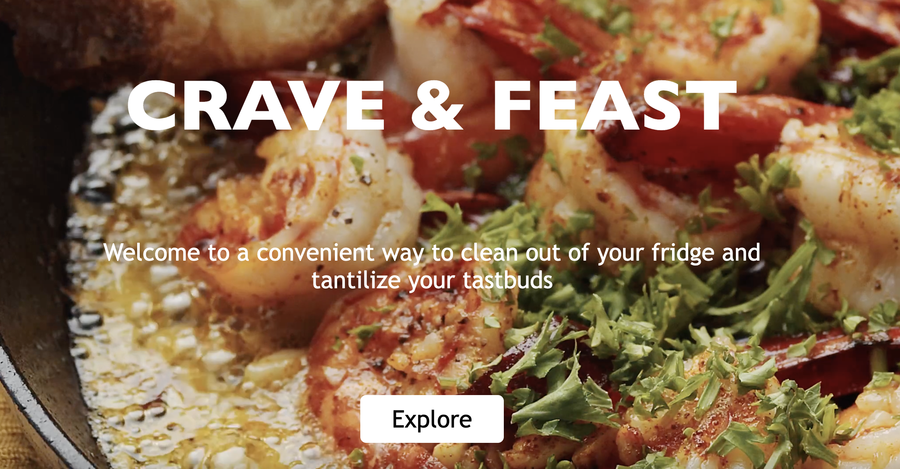

# Crave and Feast

Crave and Feast is a website application designed to help busy people create culturally diverse, nutrient dense meals. This web app was created to reduce food waste by encouraging users to use food that is already at home. 

Crave and Feast uses React frontend and Python and Flask on the backend while using Google Firebase Cloud Firestore for its database. It also aggregates recipes by using an recipe search API. Users are able to register or sign into account and search for recipes. They are also able to save or remove saved recipes from their profile page

## Demo
***

[{Crave and Feast Demo Link}](https://www.loom.com/share/e364226cb1d64206ba988a5233a4691a)


## Features
***

* Users can register and sign-in to access account
* Users can find recipes based on ingredients typed into dashboard
* Users can add favorite recipes to profile page by hearting recipe card
* Users can remove favorite recipes from profile page by hearting within profile page by hearting recipe card
* Accessible navigation using keyboard

## API
***

Crave and Feast uses Edamam Recipe Search API. An API call was completed to 
* Get recipes based on ingredients searched
* Get recipes that populate homepage

## Cloud Firestore
***

Crave and Feast used firestore to manage user data
* User registration
* Authenticate user login information
* Add favorite recipes
* Delete favorite recipes

## Installation
***

#### Frontend
* Fork this repository. 
* This will make a copy of the source code onto your github
Clone your forked repository by using the command 
```git clone```
Install node by using this command
* `npm install`
Run project on your local machine with this command
* `npm start`

#### Google Firebase
* Sign up for Firebase
* Create Project
* Create Firestore Database


